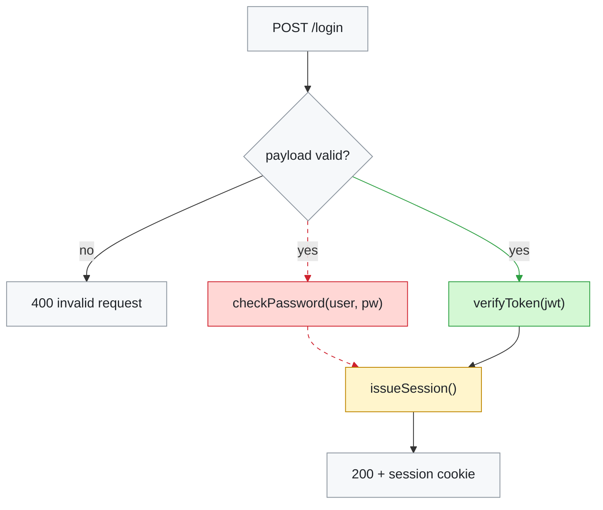

# Visualize code changes

A diff tells you which *lines* changed. It does not tell you what the code now
*does* differently — that has to be reconstructed in the reader's head, which is
exactly the expensive part. These diagrams do that reconstruction once, on paper,
so nobody has to redo it.

The output is one Markdown file holding three diagrams: **Before**, **After**, and
**What changed** (a merged, colour-coded view). The third is the one people
actually look at; the first two exist to make it trustworthy.

## Arguments

Slash-command invocations can pass arguments. How they arrive depends on the harness:

| Harness | How args show up |
|---|---|
| Claude Code | `$ARGUMENTS` is substituted below (also `$0`, `$1`, … by position) |
| Pi | Appended after the skill body as plain text (not substituted) |
| Plain chat | Treat the user's message as the args / request |

**Invoked arguments:** `$ARGUMENTS`

If that line is empty, missing, or still the literal `$ARGUMENTS`, check for a
trailing freeform args block after the skill (Pi). If neither is present, there
were no slash args — fall through to normal discovery in step 1.

### Grammar

```text
[scope] [--lens TYPE] [--focus PATH]... [--out PATH] [--slug NAME] [--render]
```

All tokens are optional. Flags may appear in any order. Unknown tokens that look
like paths become extra `--focus` entries; other free text is treated as scope.

| Token | Meaning |
|---|---|
| `scope` | What to diagram. See scope forms below. |
| `--lens TYPE` | Skip the lens prompt. One of: `control-flow`, `dependency`, `sequence`, `state`, `data-flow` (aliases: `flow`, `deps`, `seq`). |
| `--focus PATH` | Limit the diagram to this file/dir (repeatable). Still read callers/callees one hop out for context. |
| `--out PATH` | Write the markdown here instead of `docs/diagrams/<slug>.md`. |
| `--slug NAME` | Filename slug when `--out` is omitted (default: derive from branch/PR/files). |
| `--render` | After validation, also write SVGs via `validate_mermaid.py --render-to <dir>` next to the markdown (or `docs/diagrams/render/`). |

**Scope forms** (first positional token(s)):

| Form | Resolves to |
|---|---|
| *(omitted)* | Discover from context: uncommitted → staged → current branch vs main/master |
| `uncommitted` / `working` | `git diff` + `git diff --staged` |
| `staged` | `git diff --staged` only |
| `pr <n>` / `PR #<n>` / `#<n>` | `gh pr diff <n>` (fallback: `git diff main...FETCH_HEAD` after `gh pr checkout` metadata) |
| `branch <name>` | `git diff main...<name>` (or `master` if that is the default) |
| `<base>...<head>` | Exact `git diff` range (three-dot preferred for PRs) |
| `<base>..<head>` | Two-dot range when explicitly given |
| `<sha>` / `<sha>..<sha>` | `git show` / `git diff` on that commit or range |
| `HEAD` / `HEAD~N` | That commit against its parent(s) |

### Examples

```text
/skill:visualize-code-changes
/skill:visualize-code-changes uncommitted
/skill:visualize-code-changes pr 42
/skill:visualize-code-changes main...HEAD --lens sequence
/skill:visualize-code-changes branch feature/auth --focus src/auth --out docs/diagrams/auth-rewrite.md
/skill:visualize-code-changes abc1234 --lens control-flow --render
```

Claude Code also accepts `/visualize-code-changes` with the same args.

### Parsing rules

1. Apply args **before** step 1 of the workflow. They pin scope/lens/output; do not re-ask for something already specified.

2. If `--lens` is set, skip the lens question in step 3 and state the chosen lens in one line.

3. If `--focus` is set, still run `git diff --stat` on the full scope, but only deep-read and diagram the focused paths (plus one hop of callers/callees). Mention omitted files briefly in the doc Notes.

4. If scope is a PR or range and git/gh fails, say so and stop — do not silently diagram the working tree instead.

5. Shell-style quoting applies when the harness splits args (`--out "docs/my diagrams/auth.md"`). On Pi, the trailing args block is one string — parse flags with simple tokenization (split on spaces, respect double quotes).

## Workflow

### 1. Pin down what you're diagramming

If Arguments already pinned a scope, use that and skip discovery. Otherwise
establish the exact change set before drawing anything:

| Situation | Command |
|---|---|
| Work you just did / uncommitted | `git diff` and `git diff --staged` |
| A branch or PR | `git diff main...HEAD`, or `gh pr diff <n>` |
| A specific commit | `git show <sha>` |
| Not a git repo, or changes made in-session | Use your own record of what you edited |

Start with `git diff --stat` to see the shape of the change before reading hunks.
If the change spans many files, that stat output tells you which two or three
files carry the actual behaviour — diagram those, not all of them (unless
`--focus` already chose).

### 2. Read both sides, not just the diff

This is the step that gets skipped, and skipping it produces confidently wrong
diagrams. A diff hunk shows changed lines stripped of the surrounding logic, so
you cannot see the control flow the diagram needs to depict.

Read the real *before* state:

```bash
git show HEAD:path/to/file.py        # before, uncommitted work
git show main:path/to/file.py        # before, branch work
git show <base-sha>:path/to/file.py  # before, explicit range
```

and read the current file for the *after* state. Two distinctions matter because
a naive diff reading gets both backwards:

- **Moved ≠ rewritten.** A function relocated to another module shows up as a big
  delete plus a big add. Behaviour is unchanged; the diagram should say *moved*,
  not invent a new code path.
- **Renamed ≠ replaced.** `checkPassword` → `verifyCredentials` with the same body
  is one node with a new name, not a removal and an addition.

If a file is newly added there is no before state, and if deleted there is no
after — say so in the document rather than fabricating a diagram.

### 3. Choose the lens

Different changes are legible through different diagram types. If `--lens` was
passed in Arguments, use it and skip asking. Otherwise, if an
`AskUserQuestion` / `ask_user_question` tool is available, offer the choice — the user usually knows
which view they want, and asking costs one turn.
Pi and Claude Code expose `ask_user_question` built-in.
Other hosts may ship an equivalent under a different package name.

- Recommend the row below that best fits the change, marked as recommended
- Offer the plausible alternatives, not all five

When that tool isn't available, pick using this mapping and state your choice:

| The change is about… | Use | Mermaid type |
|---|---|---|
| Logic, branching, error paths | Control flow | `flowchart TD` |
| Moving code between files/modules/layers | Dependency graph | `flowchart LR` |
| A request path, API call, or service hop | Sequence | `sequenceDiagram` |
| Status/lifecycle transitions | State machine | `stateDiagram-v2` |
| How data is shaped and passed along | Data flow | `flowchart LR` |

For anything beyond a basic flowchart, read `references/diagram-types.md` for the
syntax recipe and worked examples.

### 4. Find the right altitude

Altitude is what separates a diagram that helps from one that gets glanced at and
closed. Two failure modes, equally common:

- **Too low** — a node per statement or per function call. Reproduces the code
  without compressing it, so it costs as much to read as the source did.
- **Too high** — three boxes saying `Input → Process → Output`. True of every
  program ever written, therefore worthless.

The rule that lands in the right place: **one node per step you would name if you
explained this code aloud to a colleague.** That is roughly a decision, an
externally-visible effect (network, disk, database, queue), or a meaningful
transformation. Plumbing — getters, logging, type conversion, argument shuffling
— belongs inside a node, not as its own.

Aim for **5–15 nodes**. Past that, either raise the altitude or group with
`subgraph`. And scope the picture to **the region the change touches plus one hop
of context** on either side; redrawing an entire module because three lines moved
buries the signal you were hired to surface.

Every node must map to code that genuinely exists. A diagram is read as
authoritative, so an invented branch is worse than an omitted one — when a path is
unclear, go read it rather than guessing.

### 5. Write the three diagrams

Write to `--out` if given, else `docs/diagrams/<slug>.md` where `<slug>` comes
from `--slug` or is derived from the branch/PR/files — or alongside existing docs
if the repo keeps them elsewhere. Follow `assets/template.md` for the structure.

Keep the diagrams as fenced ` ```mermaid ` source rather than exporting images.
GitHub, GitLab, and most Markdown viewers render those blocks natively, and source
stays greppable and reviewable in future diffs — an exported PNG goes stale the
moment the code moves on.

Lead the file with two or three sentences of plain prose on what the change
accomplishes. Someone skimming should get the point without decoding a diagram.

**The diff view** is a single merged graph containing before and after, with each
node and edge marked by its fate:

```
classDef added   fill:#d4f8d4,stroke:#2ea043,color:#1f2328
classDef removed fill:#ffd7d5,stroke:#cf222e,color:#1f2328
classDef changed fill:#fff5cc,stroke:#bf8700,color:#1f2328
classDef same    fill:#f6f8fa,stroke:#8c959f,color:#1f2328
```

Apply with `NodeId:::added`. Always set `color:` explicitly — without it, dark-mode
readers get dark text on a light fill and the diagram is unreadable for them.

Edges change too, and a graph that only colours nodes hides half the story. Show
removed edges as dotted (`-.->`) and style them by index with
`linkStyle N stroke:#cf222e` (indices are 0-based in declaration order).

Include a short legend so the colours don't need explaining. If before and after
differ so structurally that the merged graph turns to spaghetti, fall back to two
`subgraph` blocks side by side and note why.

**When the change is mostly relocation**, colour alone under-delivers, because
every node is technically "removed here, added there" and the reader still can't
tell which parts need reviewing. Draw a *fate map* instead: old container on one
side, new containers on the other, one edge per unit labelled with what actually
happened to it — `moved verbatim`, `moved, 3 lines changed`, `deleted, not moved`.
That labels the provenance directly rather than asking the reader to infer it, and
it answers the question people actually have during a big refactor: what can I
skip? Verify those labels by diffing the extracted function bodies, not by reading
hunks — git reports a wholesale file replacement identically whether the code was
moved or rewritten, which is the single easiest way to mislead someone.

**A fourth diagram earns its place** when one unit holds essentially all the real
logic change. The overview answers "what moved"; it cannot answer "how does this
function behave differently now". Giving that one function its own control-flow
diagram, clearly marked as a zoom, costs little and is usually where the review
actually happens. Resist adding a fourth that re-answers a question the first
three already covered — that is padding, and it dilutes the ones that matter.

### 6. Validate before handing it over

A diagram that doesn't parse renders as a red error box — worse than no diagram,
because it looks like something went wrong with the repo. Always run:

```bash
python3 <skill-dir>/scripts/validate_mermaid.py docs/diagrams/<file>.md
# with --render:
python3 <skill-dir>/scripts/validate_mermaid.py --render-to <dir> docs/diagrams/<file>.md
```

It parses every block with `mermaid-cli` when available and falls back to built-in
heuristics otherwise, reporting errors against real line numbers in your file.
Fix anything it flags and re-run until clean. It also catches style classes that
are used but never defined — those render without error but silently lose their
colour, which is exactly the kind of bug that survives a visual skim.

Always pass `--render-to` when Arguments included `--render`; also use it when
the user asks for images even without the flag.

## Syntax that will bite you

The overwhelmingly common break is **unquoted special characters in labels**.
Parentheses, brackets, and pipes terminate a label early:

```
A[login(req)]     ← breaks the parser
A["login(req)"]   ← correct
```

Quote every label containing `()`, `[]`, `{}`, `|`, `:`, or `,` — quoting
defensively costs nothing. `references/syntax-pitfalls.md` covers the rest
(reserved words like `end`, subgraph IDs, arrow-label escaping).

## Worked example

A change that swapped password auth for token auth, at the right altitude:



Counting the links in declaration order: `0` R→V, `1` V→E, `2` V→P, `3` V→T,
`4` P→S, `5` T→S, `6` S→OK. So the dead password path is links 2 and 4, and the
new token path is link 3. Miscounting here is easy and silently mislabels the
change, so recount against the finished diagram before you ship it.

Seven nodes, and the change reads at a glance: the password branch is gone, a
token branch replaces it, session issuance was touched, and the surrounding
request handling is untouched. Note what is *absent* — request parsing, logging,
and DB connection handling all exist in the real code but would have added noise
without adding understanding.

## Finishing up

Report the file path and summarise the change in a sentence or two. If you had to
guess at any behaviour, say which parts and why — a reader who knows where the
soft spots are can trust the rest.

## Reference files

- `references/diagram-types.md` — picking a lens; syntax recipes for sequence,
  state, class, and dependency diagrams
- `references/syntax-pitfalls.md` — escaping, reserved words, theme-safe styling
- `assets/template.md` — the output document skeleton
- `scripts/validate_mermaid.py` — the validator from step 6
