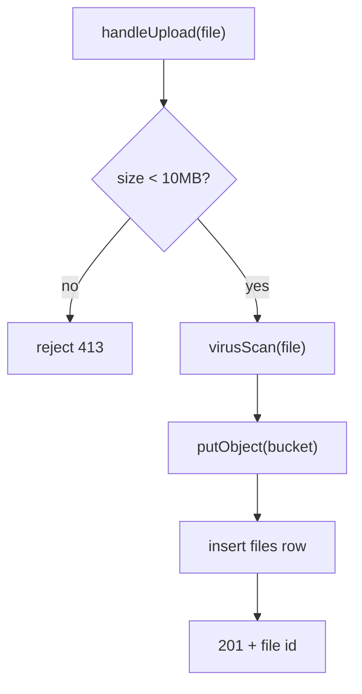
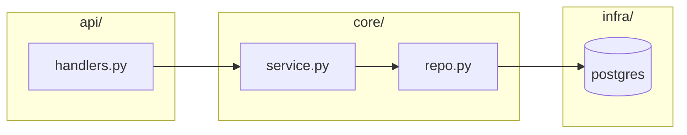
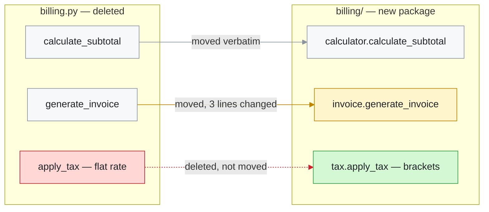
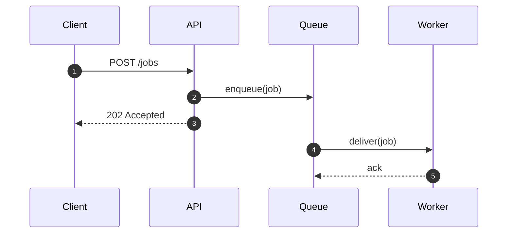
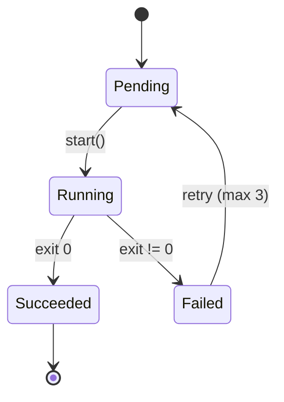
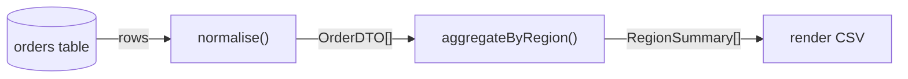
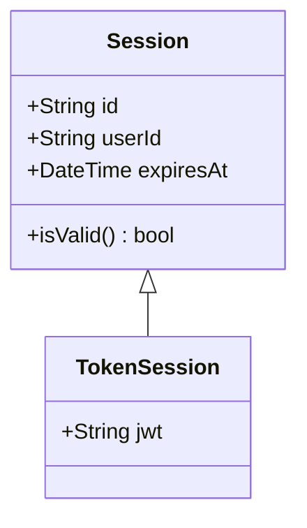
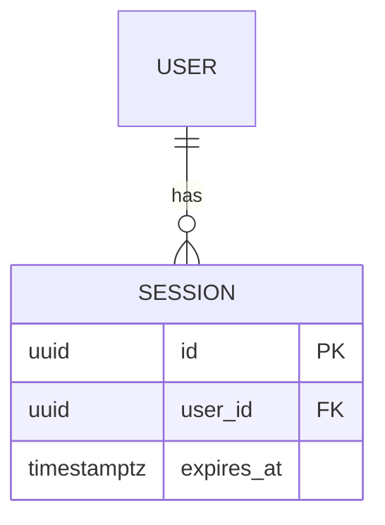
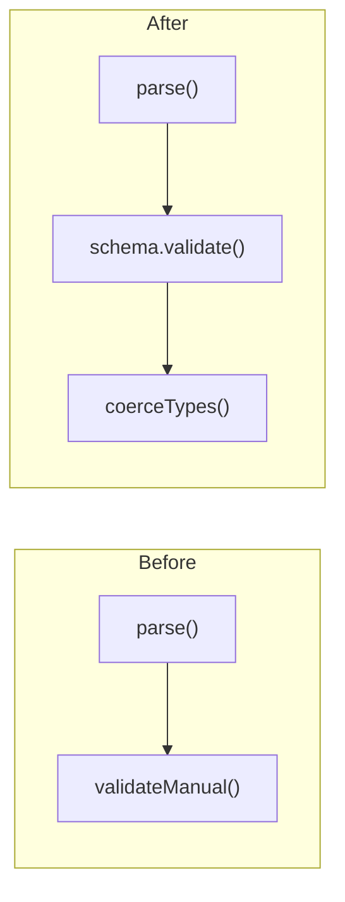

# Choosing and writing the right diagram

Read this when the change needs anything beyond a basic `flowchart TD`. Each
section gives the selection rationale, a working skeleton, and how to express
before/after/diff in that diagram type — the diff view is the awkward part for
non-flowchart types, and the answers differ.

## Contents

1. [Picking a lens](#picking-a-lens)
2. [Control flow — flowchart](#control-flow--flowchart)
3. [Module & dependency graphs](#module--dependency-graphs)
4. [Sequence diagrams](#sequence-diagrams)
5. [State machines](#state-machines)
6. [Data flow](#data-flow)
7. [Class & schema diagrams](#class--schema-diagrams)
8. [When the merged diff view stops working](#when-the-merged-diff-view-stops-working)

---

## Picking a lens

Ask what question the reader arrives with. The diagram type follows from the
question, not from the code's language or framework.

| Reader's question | Lens | Type |
|---|---|---|
| "Which path does execution take now?" | Control flow | `flowchart TD` |
| "What depends on what after the move?" | Dependency graph | `flowchart LR` |
| "Who calls whom, in what order?" | Sequence | `sequenceDiagram` |
| "What states can this be in?" | State machine | `stateDiagram-v2` |
| "How does the data get transformed?" | Data flow | `flowchart LR` |
| "What shape is this type/table now?" | Structure | `classDiagram` / `erDiagram` |

A change often admits two valid lenses — a new caching layer is both a control
flow change and a dependency change. When `AskUserQuestion` / `ask_user_question` is available, offer
the two strongest candidates rather than guessing. Two diagrams answering two
different questions is fine; two diagrams answering the same question is padding.

---

## Control flow — flowchart

The default, and right for most logic changes. `TD` (top-down) suits branching and
error paths; `LR` suits pipelines.



Shape conventions readers already know, worth keeping consistent:

| Shape | Syntax | Means |
|---|---|---|
| Rectangle | `A["doThing()"]` | a step |
| Diamond | `B{"ok?"}` | a decision |
| Rounded | `C("entry point")` | start/end |
| Cylinder | `D[("sessions")]` | datastore |
| Subroutine | `E[["renderPage()"]]` | call into another documented flow |

Label decision edges with the condition (`-->|yes|`). An unlabelled branch forces
the reader back into the source, which defeats the purpose.

**Diff view:** merged graph, `:::added` / `:::removed` / `:::changed` / `:::same`
per node, dotted red edges for dead paths. This is the case the SKILL.md example
covers.

---

## Module & dependency graphs

For changes that move code rather than alter logic — extracting a module,
inverting a dependency, introducing a layer. `LR` reads best since dependency is
naturally left-to-right.



Use `subgraph` for the layer/package boundary — the boundary is usually the whole
point of the change. One node per module, not per function; if a module needs
internal detail, that is a second diagram.

**Diff view:** colour the *edges* as much as the nodes. Dependency changes are
edge changes, and a graph that only recolours boxes will look nearly identical
before and after. Show a removed dependency as a dotted red edge that still
appears in the merged view, so the reader sees what was severed.

### The fate map

When a change is mostly relocation — a module split, a package extraction, a
layer being carved out — plain colour coding fails. Every unit is "removed from
here, added over there", so everything lights up and the reader learns nothing
about where to spend attention.

Put the old container on one side and the new ones on the other, then draw one
edge per unit, labelled with what happened to it:



The edge labels are the payload. `moved verbatim` means *skip this file*, which
is often the most valuable sentence in the whole document.

Earn those labels rather than guessing them. Git reports a wholesale file
replacement the same way whether code was relocated untouched or rewritten from
scratch, so compare the actual bodies:

```bash
git show main:billing.py | awk '/^def calculate_subtotal/,/^$/' > /tmp/before.txt
git show HEAD:billing/calculator.py | awk '/^def calculate_subtotal/,/^$/' > /tmp/after.txt
diff /tmp/before.txt /tmp/after.txt && echo "identical -- moved, not rewritten"
```

Pairing the fate map with a small table — file, what happened, review effort —
turns the diagram into something a reviewer can act on immediately.

---

## Sequence diagrams

Right when ordering, round trips, or who-initiates-what is the substance —
auth handshakes, retries, webhook flows, anything touching multiple services.
A flowchart cannot express "then B replies to A" without lying about time.



`autonumber` earns its place — it gives the reader stable numbers to refer to.
Declare participants explicitly to control column order. Use `-->>` for replies
and `-)` for fire-and-forget.

Structural blocks, each closed by `end`:

```
alt token expired
    A-->>C: 401
else valid
    A-->>C: 200
end

loop every 30s
    W->>A: heartbeat
end

opt if cache miss
    A->>DB: query
end
```

**Diff view:** sequence diagrams have no `classDef`, so the flowchart colouring
approach does not transfer. Two options that do work:

- `rect rgb(212,248,212)` blocks wrapping added exchanges, `rgb(255,215,213)` for
  removed ones — the closest thing to the standard colour coding:

  ```
  rect rgb(212, 248, 212)
      A->>T: verifyToken(jwt)
  end
  ```

- Annotate message text directly: `A->>B: [ADDED] verifyToken(jwt)` and
  `Note over A,B: removed — checkPassword()`.

The `rect` approach is better when added/removed steps are contiguous; annotation
is better when changes are scattered through a long exchange.

---

## State machines

For lifecycle changes — order status, connection handling, job states, feature
flags. Use it when the change adds or removes a state or a transition, which is
exactly the kind of change a diff obscures badly.



Label transitions with what triggers them. `[*]` marks entry and exit.

**Diff view:** `stateDiagram-v2` does support `classDef` and `:::`, so the normal
colour coding works:

```
Cancelled:::added
classDef added fill:#d4f8d4,stroke:#2ea043,color:#1f2328
```

A newly reachable state and a newly *unreachable* one are both easy to miss in a
diff and obvious in this view — call them out in prose too.

---

## Data flow

For changes to how data is shaped and moved: a new transformation step, a changed
schema, a different serialisation boundary. `LR` with the payload shape in the
edge labels:



Putting the type or shape on the edge is what distinguishes this from a control
flow diagram, and it is usually where the change lives — a field added to a DTO
shows up as an edge-label change even when every node is untouched.

---

## Class & schema diagrams

For changes to type structure, inheritance, or database schema.



Relations: `<|--` inheritance, `*--` composition, `o--` aggregation, `-->`
association.

For database work `erDiagram` is usually the better fit:



**Diff view:** neither type supports `classDef` reliably. Mark changed members in
the member text (`+jwt String  << added >>`) or annotate with a `note`. For schema
changes, a small added/removed/changed table beneath the diagram is often clearer
than colour anyway, since column-level detail is what reviewers check.

---

## When the merged diff view stops working

The merged graph is the default because it puts the change in one picture. It
fails when before and after share almost no structure — a genuine rewrite rather
than an edit. Symptoms: more than about half the nodes are `added` or `removed`,
or the graph has two disconnected components that only meet at the entry point.

At that point the merged view is just the two diagrams overlaid with extra colour,
and readers do better with an explicit side-by-side:



Say in the prose why you switched — "this was a rewrite rather than an edit, so a
merged view would not be legible" tells the reader something true about the change
itself, which is useful information rather than an apology.
